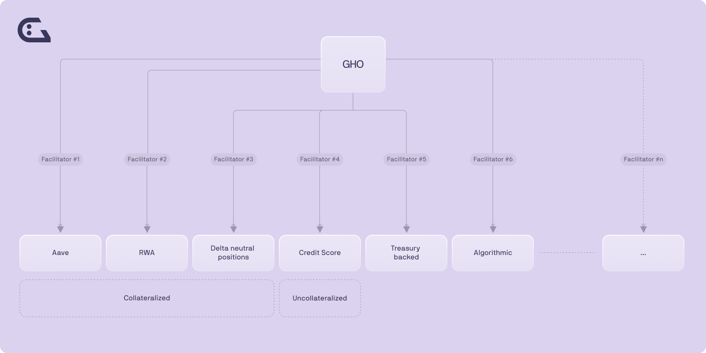

# GHO FAQ

## What is GHO?

GHO is a decentralized multi-collateral stablecoin that is fully backed and native to the Aave Protocol. GHO’s value is pegged to the US Dollar and the peg will be maintained through market efficiency.

As a decentralized stablecoin on the Ethereum Mainnet, GHO will be minted by users (or borrowers). As with all borrowing on the Aave Protocol, a user must supply collateral (at a specific collateral ratio) to be able to mint GHO. Correspondingly, when a user repays a borrow position (or is liquidated), the GHO protocol burns that user’s GHO. All the interest payments accrued by minters of GHO would be directly transferred to the AaveDAO treasury; rather than the standard reserve factor collected when users borrow other assets.

## Why GHO?

## How is the value of GHO kept stable?

GHO will be kept stable through market efficiencies. It is envisioned that if GHO were to be valued > $1, the market would arbitrage the value back to $1 as it would be profitable to swap GHO for other stablecoins. If GHO were to be valued < $1, then it would be profitable to pay back debt, and will result in GHO total supply decreasing as debt is repaid will help the peg to be restored.

## GHO Interest Rates

Borrow interest rates for GHO will be determined by the AaveDAO, with a stable rate that may be adapted depending on market conditions. This design retains the Aave Protocol’s borrow interest rate model flexibility, and it will be possible in the future to implement any interest rate strategy the Aave community sees fit.

The first decision regarding the GHO interest rates can be seen [here](./concepts/fundamental-concepts/gho-discount-strategy)

### Interest Rate Discount Model for stkAAVE

Given the nature of the asset, this integration allows for innovative features that provide greater utility for governance and community participants. The implementation of GHO includes a Discount Strategy mechanism. The initial discount strategy allows for Safety Module participants (stkAAVE holders) to access a discount on the GHO borrow rate. The strategy will set a certain amount of GHO at discount per stkAAVE supplied, and a discount on the interest rates that can vary from 0% (no discount) to 100% (full discount). These parameters are controlled by Aave governance.

The parameters for Ethereum Mainnet still need to be voted on by the community.

[https://docs.google.com/spreadsheets/d/1icTBIL3VijAbdn3mHIDkeScdphDGn_LVue3j2e7Ssoo/edit#gid=474599885](https://docs.google.com/spreadsheets/d/1icTBIL3VijAbdn3mHIDkeScdphDGn_LVue3j2e7Ssoo/edit#gid=474599885)

## How can I mint GHO?

To mint GHO, you first need to supply assets as collateral to the Aave Protocol. Once the collateral has been deposited, then you mint GHO. See the below GIF to see how to mint GHO.

—Insert GIF on how to mint GHO.

It is important to take note of your health factor, changes in the collateral price will impact your health factor and if your health factor falls below 1, your collateral will be liquidated. See more information regarding [liquidations](https://docs.aave.com/developers/guides/liquidations).

## Facilitators

### What is a Facilitator and what does it mean for GHO?

GHO introduces the concept of Facilitators. A Facilitator (e.g., a protocol, an entity, etc.) has the ability to trustlessly mint (and burn) GHO tokens. To be added as a facilitator they would have to be approved by Aave Governance. Various facilitators will be able to apply different strategies to their generation of GHO. Aave Protocol on Ethereum Mainnet is the first facilitator.

Governance will be able to determine and assign this facilitator a specific bucket capacity to bootstrap the GHO liquidity and the GHO market.

